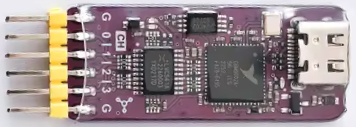

# `TENTACLE_DAQ_saleae`

## DAQ

The DAQ is read out using sigrok.

[sigrok / Saleae](https://sigrok.org/wiki/Noname_Saleae_Logic_clone)

[Github](https://github.com/WeActStudio/LogicAnalyzerV1)

[Aliexpress](https://www.aliexpress.com/item/1005003649856071.html) USD $5.80

