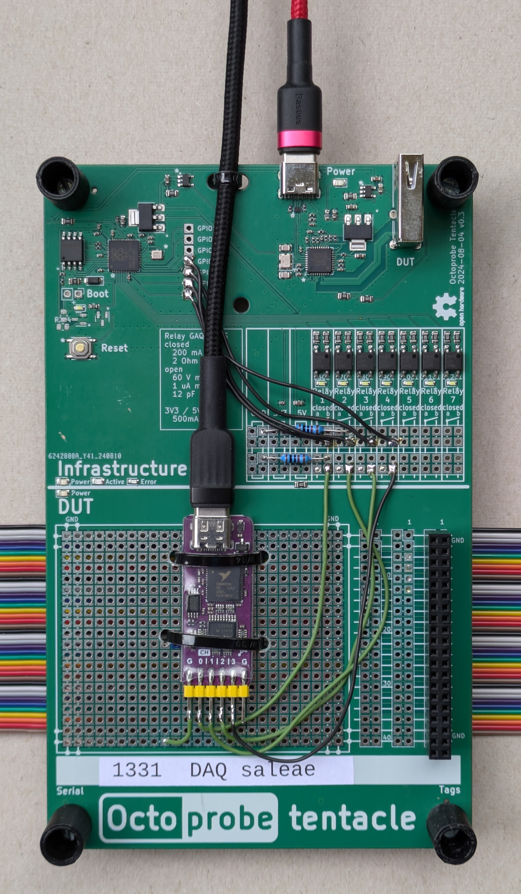

Tentacle `DAQ_SALEAE`
=====================

:download:`Schematics </../schematics_kicad/schematics.pdf>`

This tentacle is used to store/interpret the signals while testing. The DAQ is read out using sigrok_.

FUT implemented
---------------

* Error recovery
  
  This tentacle allows shortening of the signals to ground/VCC and thus introduces errors.
  This allows to test error recovery.

.. _sigrok: https://sigrok.org

WeActStudio DAQ
----------------

Project page for Saleae_.

.. _Saleae: https://sigrok.org/wiki/Noname_Saleae_Logic_clone

WeActStudio on github_

.. _github: https://github.com/WeActStudio/LogicAnalyzerV1

Product page on Aliexpress_ (USD $5.80)

.. _Aliexpress: https://www.aliexpress.com/item/1005003649856071.html

.. image:: weact_logic_analyzer_b.png

.. image:: weact_logic_analyzer_a.png

