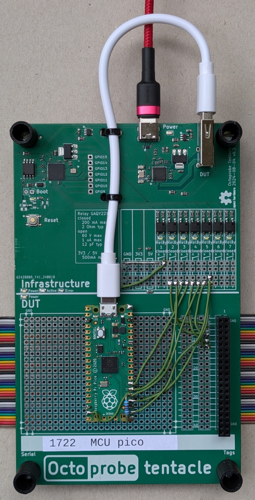

Tentacle `MCU_RPI_PICO` / `MCU_RPI_PICO2`
===========================================

Supported FUTs: FUT_I2C, FUT_UART, FUT_ONEWIRE, FUT_TIMER, FUT_EXTMOD_HARDWARE

v1.1 connects GP0/GP1/signal_1 (FUT_EXTMOD_HARDWARE) 

:download:`Schematics </../schematics_kicad/schematics.pdf>`

The same tentacle may be applied for the

===========  =============  ==============
Board        Tentacle name  Variants
===========  =============  ==============
Pico rp2040  MCU_RPI_PICO   arm
Pico rp2340  MCU_RPI_PICO2  arm AND risc-V
===========  =============  ==============

* `Pinout PICO <https://www.raspberrypi.com/documentation/microcontrollers/images/pico-pinout.svg>`_
* `Pinout PICO2 <https://datasheets.raspberrypi.com/pico/Pico-2-Pinout.pdf>`_

Pins assignements
-----------------

====  =======  ========  ==========
CPU   Pin      signals   rationale
====  =======  ========  ==========
TP6   BOOTSEL            Switch between programming and application mode
GP20  26       trigger1
GP21  27       trigger2
GP16  21       TX        UART0
GP17  22       RX        UART0
GP19  25       SCL       I2C1
GP18  24       SDA       I2C1
GP14  19       onewire
====  =======  ========  ==========
