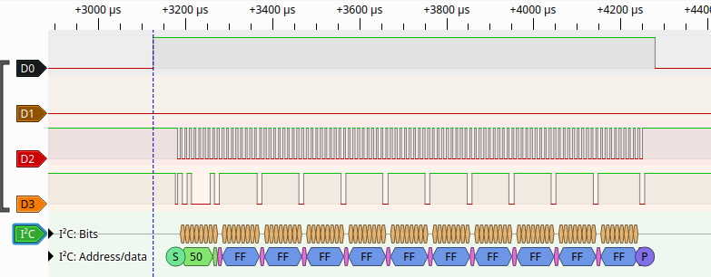

Testsbeds produced
==================

.. tip::

    This page demonstrates how to check if a testbed works correctly.

Tentacles inventory
-------------------

.. literalinclude:: ../../../src/testbed/tentacles_inventory.py
   :language: python
   :linenos:

Delivery Inspection / Function check
------------------------------------

.. rubric:: Steps for function check

* Connect all tentacles via USB with the computer
* Connect all tentacles via Octobus
* Pulseview:
  
  * Start pulseview: `sudo ./pulseview-NIGHTLY-x86_64-debug.appimage`
  * 1 M samples/ 16 MHz
  * Raising edge trigger on D0
  * 5% pre trigger
  * I2C-SCL: D2
  * I2C-SDA: D3
* Run the tests:

.. code:: 

    pytest -v -s \
          --firmware-json=pytest_args_firmware_RPI_PICO2_v1.24.0.json \
          tests/test_simple.py::test_i2c_pattern

.. rubric:: Expected text output

.. code:: 

    collected 1 items                                                                                     

    tests/test_simple.py::test_i2c_pattern[1831pico2(RPI_PICO2)-3f31potpourry-1331daq] PASSED
    ========================================== 2 passed in 7.15s ==========================================

.. rubric::: Expected pulseview screenshot for test_i2c_pattern:

.. image:: images/pulseview_i2c_pattern.png

.. code:: 

    pytest -v -s \
          --firmware-json=pytest_args_firmware_RPI_PICO2_v1.24.0.json \
          tests/test_simple.py

.. rubric:: Expected text output

.. code:: 

    collected 2 items                                                                                     

    tests/test_simple.py::test_i2c[1831pico2(RPI_PICO2)-3f31potpourry-1331daq] PASSED
    tests/test_simple.py::test_onewire[1831pico2(RPI_PICO2)-3f31potpourry-1331daq] PASSED
    ========================================== 2 passed in 7.15s ==========================================

Expected pulseview screenshot for I2C:

.. note::
  
    If these test succeed:

    * The configuration file `testbed_ch_wetzikon_1.py` contains the correct serial numbers.
    * The tentacles
      * are correctly connected and work.
      * are connected correctly via the Octobus
    * The tentacles MCUs etc. are soldered correctly
  