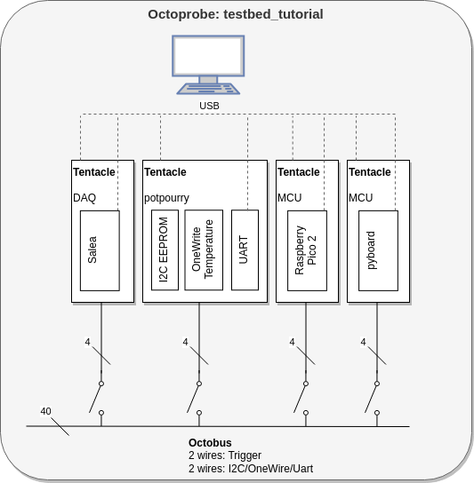

Design decisions
================

Every testbed requires a unique name. This here is called `testbed_tutorial`.

.. note::
  
  Other testbed could be:

  * `testbed_modbus`: Modbus RTU is very time critical, specially timeouts/retires. This testbed could test these timing aspects, specially in error and race condition.
  * `testbed_I2C_multicontroller`: In multicontroller (multimaster) mode many special situations an race condition may occur. This testbed could provide the hardware to create error conditions like shortening the bus. It may be tested if and how the software recovers from these errors.
  * ...

`testbed_tutorial` is designed to demonstrates the various aspects of octoprobe. But also allows to write/run meaningful tests.

.. rubric:: Block diagram

.. rubric:: Testing the pico firmware agains I2C and capture with DAQ

.. image:: block_diagram_pico.drawio.png
   :height: 500px
   :align: center

.. rubric:: Testing the pyboard firmware agains I2C and capture with DAQ

.. image:: block_diagram_pyboard.drawio.png
   :height: 500px
   :align: center

.. rubric:: Every testbed must specify:

Signals
  See :doc:`/testbed_tutorial/40_specification/10_octobus-signals`

Tentacle Roles
  See :doc:`/testbed_tutorial/40_specification/20_tentacle-roles`

FUTs (*FUT*: Feature Under Test)
  See :doc:`/testbed_tutorial/40_specification/30_feature-under-test`

